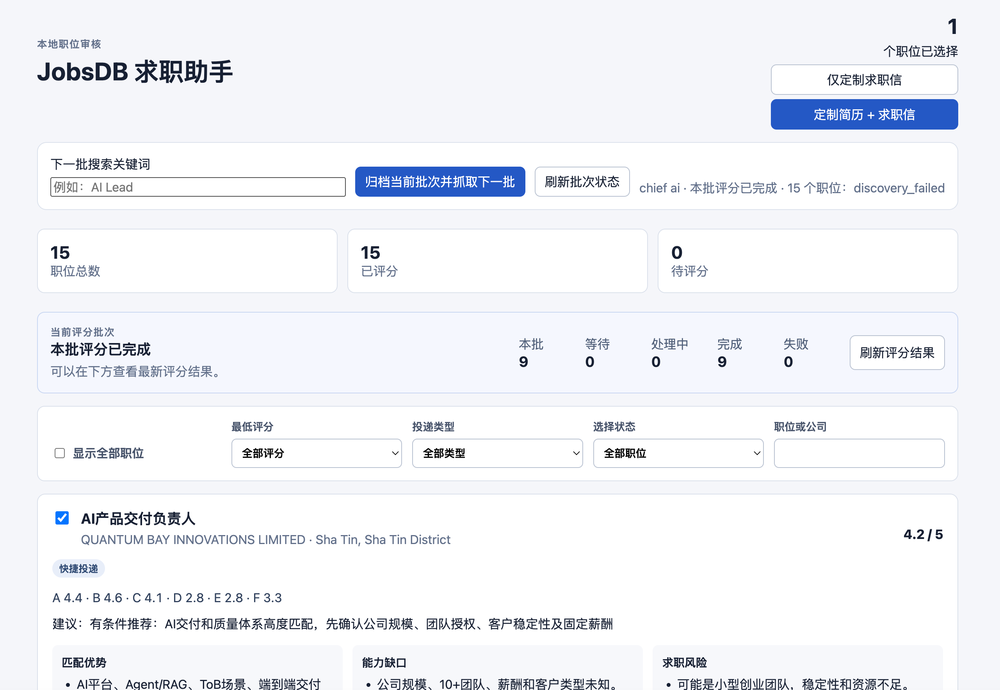

# JobsDB Assistant

当前版本：`v0.8.0`

JobsDB Assistant 是面向香港 JobsDB 的本地求职工作台。它把职位抓取、候选人
画像、Career Ops 职位评分、简体中文 JD 翻译、定制简历与求职信、材料审核，
以及 Quick Apply 执行串成一个可恢复的流程。

产品默认由 Claude Code（CC）或 Codex 中的 `jobsdb-assistant` Skill 启动。
Python 和 SQLite 负责流程、状态、任务标识及人工门禁；Agent 只处理需要 AI
推理的工作。候选人资料、JD、材料、浏览器登录态和运行记录全部保存在本机。

---

# 第一部分：产品架构

## 1. 设计目标

JobsDB Assistant 的核心原则是：

- **一个主流程**：用户从 CC/Codex 启动一次，之后主要在本地 Dashboard 操作。
- **Python 管状态，Agent 做推理**：任务顺序、重试、缓存、审批和投递状态不依赖
  Agent 的上下文记忆。
- **复用而不修改上游项目**：通过 Adapter 消费固定版本的 public fork。
- **默认人工确认**：画像、材料和最终提交都不能由系统替用户批准。
- **本地优先和公开仓库安全**：私有运行数据不进入 Git，也不上传 CI artifact。

## 2. 总体架构

```text
Claude Code / Codex
└── jobsdb-assistant Skill
    ├── 启动或恢复 Agent 会话
    ├── 完成画像、评分和材料等 AI 任务
    └── 遵守 Python 返回的不透明任务协议
                         │
                         ▼
┌─────────────────────────────────────────────────────────────┐
│                  JobsDB Assistant Python 主流程              │
│                                                             │
│  Job Batch ─ Candidate Profile ─ Evaluation ─ Materials     │
│      │              │              │             │           │
│      └──────────────┴──────────────┴─────────────┘           │
│                   SQLite / Checkpoints                       │
│                                                             │
│  Dashboard API ─ Human Gates ─ Application Execution         │
└───────────────┬───────────────────────────────┬───────────────┘
                │                               │
                ▼                               ▼
      固定版本能力 Adapter                 JobsDB 浏览器引擎
      ├── ai-job-search                   ├── 公开职位抓取
      └── career-ops                      ├── 登录态复用
                                          └── Quick Apply
```

### 2.1 真实产品界面



上图来自真实本地运行环境：当前批次包含 15 个职位，Dashboard 展示完整评分进度、
职位筛选、Career Ops A–F 结果，以及“仅定制求职信”和“定制简历 + 求职信”
两个独立材料入口。

### 2.2 CC/Codex Skill

仓库为两种 Agent 客户端提供语义一致的 Skill：

- Codex/open-agent：`.agents/skills/jobsdb-assistant/SKILL.md`
- Claude Code：`.claude/skills/jobsdb-assistant/SKILL.md`

Skill 只调用稳定的 Python Agent 协议，并复制 Python 返回的 `session`、
`work_id`、输入路径和输出路径。它不自行构造职位 ID，不查询 SQLite，也不通过
阅读源码猜测下一步命令。

评分默认使用一个持续运行的 Agent 串行处理当前 15 个职位。仓库保留固定三槽
Pool 作为显式并行实验入口，但它目前不是日常默认流程。

### 2.3 Python 主流程

Python 是工作流的权威控制层，负责：

- 安装和校验固定 SHA 的上游 fork；
- 创建及恢复候选人画像、评分、材料和申请任务；
- 生成不透明任务 ID，并校验 Agent 返回的 schema；
- 管理任务租约、失败隔离、缓存和恢复；
- 执行事实一致性、PDF 模板和材料版本检查；
- 在 Dashboard 暴露人工审核入口；
- 区分 Quick Apply 和 Apply 的最终执行路径。

即使 CC/Codex 关闭，已经完成的步骤也会保留。再次启动 Skill 后，Python 会从
本地状态继续未完成任务，而不是依赖 Agent 回忆此前对话。

### 2.4 能力 Adapter

主项目固定并只读消费两个 public fork：

| 能力 | 来源 | 主项目职责 |
|---|---|---|
| 候选人资料提取与访谈 | `ai-job-search` | 保存原始回答，补齐必问信息，映射为不可变 Profile |
| 定制材料能力 | `ai-job-search` | 为每个职位生成独立材料，并执行事实与格式校验 |
| 职位匹配评分 | `career-ops` | 使用原生 A–F、1.0–5.0 评分，不增加第二套评分规则 |

Adapter 把候选人简历和访谈结果映射为 Career Ops 能直接消费的 `cv.md`、
`config/profile.yml` 和 `modes/_profile.md`。上游 fork 的代码不由本项目修改，
升级时必须显式更新 manifest 中的固定提交。

### 2.5 JobsDB 浏览器引擎

JobsDB 自动化引擎基于 Python、Playwright 和持久化浏览器 Profile：

- 公开职位搜索和评分不要求 JobsDB 登录；
- Quick Apply 才复用用户手动建立的登录态；
- Apply 表示需要进入企业网站，系统只打开 JobsDB 职位详情并交给用户；
- 验证码、复杂表单、登录失效和不确定的提交结果都会转为人工处理；
- 浏览器层通过 `BrowserPort` / `PageController` 与业务状态机解耦，测试可使用
  Fake 实现而不启动真实浏览器。

## 3. 完整数据流

### 3.1 首次使用

```text
用户简历
  → ai-job-search 提取事实
  → 逐项画像访谈
  → 用户确认 Candidate Profile
  → 映射为 Career Ops Profile Bundle
  → 保存不可变 Profile 版本
```

简历解析只是访谈输入，不代表画像已经完成。Python 会检查必问维度，只有用户
回答、明确跳过或确认不提供后，才允许生成并确认画像。

### 3.2 日常职位流程

```text
Dashboard 输入单一关键词
  → 公开浏览器抓取最多 15 个历史未出现职位
  → 保存不可变 JD Snapshot
  → Python 创建评分任务
  → Agent 完整翻译 JD 并执行 Career Ops A–F 评分
  → Dashboard 人工选择职位
  → 每个职位独立生成材料
  → 用户审核、重生成、拒绝或批准
  → Quick Apply 自动准备 / Apply 人工投递
```

归档当前批次后，旧批次不再显示在 Dashboard。相同关键词可以再次搜索，但新批次
会排除仍在历史记录中的职位。归档超过 30 天的批次及其独占运行数据会在清理流程
中删除。

### 3.3 增量评分

评分缓存身份由以下内容共同决定：

```text
JD hash
+ Candidate Profile / Profile Bundle hash
+ career-ops 固定提交
+ Adapter contract version
```

输入完全相同时复用已有评分；JD、画像或评分引擎版本发生变化时，创建新的评分。
每个职位始终是独立任务，一项失败不会阻塞其他职位。

## 4. Dashboard 与材料

Dashboard 是本地审核界面，只监听 `127.0.0.1`。它负责展示和人工决策，不在
浏览器 JavaScript 中执行 AI 推理。

每个已选择职位支持两种材料模式：

- **仅定制求职信**：生成一封 100–300 个英文单词的求职信；投递继续使用 JobsDB
  默认简历。
- **定制简历 + 求职信**：为每个职位分别生成一份英文 PDF 和一封 100–300 个
  英文单词的求职信。

定制简历以唯一的两页 v5 PDF 为模板，只允许修改：

- `Professional Summary`
- 四条 `Career Highlights`
- 三项 `Core Competencies`

`Work Experience` 及其后所有内容保持不变。Reviewer 和 ATS 建议只供参考，不
阻塞材料；事实一致性仍是硬性检查。发现疑似虚构内容时，材料会保留并列明风险，
用户可以拒绝、重新生成，或明确覆盖风险后批准。

## 5. 申请执行边界

| 职位类型 | 支持方式 |
|---|---|
| Quick Apply | 使用默认简历快捷投递，或使用已批准的定制材料准备申请 |
| Apply | 打开 JobsDB 详情页，下载/复制材料后由用户进入企业网站投递 |

Quick Apply 使用定制简历时：

1. 保留 JobsDB 默认简历；
2. 删除其他非默认简历；
3. 上传并核对当前职位对应的定制 PDF；
4. 填写对应求职信；
5. 停在 Review 页面等待用户确认；
6. 用户在 Dashboard 点击“确认提交”后才执行最终提交。

仅定制求职信模式不删除、上传或切换简历。默认简历快捷入口也不会生成材料，
并且明确使用 `JobsDB default CV`、`no cover letter`。

## 6. 状态、隐私与目录

Python 和 SQLite 是运行状态权威。主要私有目录包括：

```text
data/                         # SQLite、cookies、浏览器 Profile、日志
workspace/ai-tasks/           # Agent 输入输出检查点
workspace/materials/          # 每职位不可变材料版本
workspace/resume-template-v5.pdf
accounts/
.env
```

这些路径均被 `.gitignore` 忽略。公开仓库只保存代码、schema、测试、Skill 和
不含候选人数据的文档。

主要代码结构：

```text
src/
├── adapters/      # ai-job-search / career-ops schema-bound Adapter
├── application/   # 画像、评分、材料、Agent 协议和申请主流程
├── browser/       # 浏览器端口、Fake 与 Playwright 实现
├── dashboard/     # 本地 FastAPI/Jinja2/Vanilla JS 审核界面
├── domain/        # Profile、JD、评分、材料和申请契约
├── integrations/  # 固定 fork manifest 与只读校验
├── jobsdb/        # JobsDB 登录、选择器和 Apply 状态机
├── materials/     # PDF、事实一致性和不可变版本校验
├── storage/       # SQLite repositories、cookies 与 migrations
└── orchestrator.py
```

技术栈：Python 3.11+、Playwright、SQLite、Pydantic、FastAPI、Jinja2、
pytest、ruff、uv。

---

# 第二部分：使用方法和注意事项

## 1. 安装

推荐使用 Python 3.11 和 `uv`：

```bash
uv venv --python 3.11
uv sync --extra dev --extra dashboard
uv run playwright install chromium
uv pip list
uv run jobsdb-assistant --version
uv run jobsdb-assistant doctor
```

依赖版本由 `uv.lock` 固定。其他电脑或新用户应在仓库根目录执行相同命令，并
使用项目统一的 `.venv`，不要为 Dashboard 单独创建第二套环境。

## 2. 准备简历

首次画像可以读取用户提供的 PDF 或其他受支持的简历资料。启动 Skill 时使用绝对
路径传入，例如：

```text
使用 jobsdb-assistant，根据 /absolute/path/resume.pdf 启动求职助手
```

完整定制简历还需要唯一的两页 v5 模板，默认私有路径为：

```text
workspace/resume-template-v5.pdf
```

也可以通过环境变量指定：

```bash
export JOBSDB_RESUME_TEMPLATE_PATH=/absolute/path/resume-v5.pdf
```

Career Ops 的 `cv.md` 只用于评分上下文，不会被当作 PDF 模板。

## 3. 推荐启动方式：CC/Codex Skill

在仓库目录打开 Claude Code 或 Codex，然后说：

```text
使用 jobsdb-assistant 启动求职助手
```

首次使用时在同一句话中提供简历绝对路径。Skill 会依次执行环境检查、启动或恢复
Agent 会话，并打开本地 Dashboard。用户无需自己寻找职位 ID 或任务 ID。
之后可以直接在 Dashboard 搜索、选择和审核，无需再次返回 Agent 说“继续”。

对应的稳定 Python 协议为：

```bash
uv run jobsdb-assistant agent doctor
uv run jobsdb-assistant agent start --source /absolute/path/resume.pdf
uv run jobsdb-assistant agent listen --session SESSION
```

正常使用不需要手工执行这些命令。`SESSION` 和工作 ID 都是不透明值，只能复制
Python 返回的原值，不能自行拼接。
`agent next --session SESSION --wait 0` 只用于一次性诊断，不代替持续运行的
`agent listen`。

## 4. 首次画像流程

首次启动会：

1. 安装或校验 manifest 中固定提交的两个 public fork；
2. 解析用户简历；
3. 逐项询问目标职位、工作内容、公司和团队偏好、薪酬、推荐人及其他必问信息；
4. 生成完整候选人画像供用户检查；
5. 用户明确确认后保存不可变 Profile 版本；
6. 等待 Dashboard 创建职位批次。

敏感项目可以选择不提供，但 Agent 不能替用户猜测答案。只有用户明确要求更新画像
时才创建新版本；普通的第二次启动会复用已有画像和已安装 fork。

## 5. Dashboard 日常流程

Dashboard 默认地址：

```text
http://127.0.0.1:8765
```

推荐操作顺序：

1. 保持当前 CC/Codex Agent 会话运行。
2. 在“下一批搜索关键词”输入一个关键词，例如 `AI Lead`。
3. 点击“归档当前批次并抓取下一批”。
4. 后台公开浏览器抓取最多 15 个历史未出现职位，并准备评分任务。
5. Agent 逐个完成完整简体中文 JD 翻译和 Career Ops A–F 评分。
6. 点击“刷新批次状态”和“刷新评分结果”查看最新结果。
7. 勾选一个或多个职位。
8. 选择“仅定制求职信”或“定制简历 + 求职信”。
9. 打开每个职位的材料页面进行预览、批准、拒绝或重新生成。
10. 对批准材料点击“准备申请”；Quick Apply 在 Review 页面再次等待最终确认。

Dashboard 不会自动刷新整个页面。抓取、评分和材料生成完成后，需要用户点击对应的
手动刷新按钮。

## 6. Dashboard 诊断启动

通常 `agent start` 会启动或复用 Dashboard。只有诊断时才需要手工执行：

```bash
uv run python -m src.main dashboard doctor
uv run python -m src.main dashboard start
```

不自动打开浏览器：

```bash
uv run python -m src.main dashboard start --no-browser
```

前台运行时使用 `Ctrl+C` 停止 Dashboard。

端口被占用时命令会明确失败。可显式改用其他端口：

```bash
uv run python -m src.main dashboard doctor --port 8877
uv run python -m src.main dashboard start --port 8877
```

健康检查：

```text
http://127.0.0.1:8765/health
```

## 7. 登录与申请

职位抓取、JD 翻译和评分不需要 JobsDB 登录。只有执行 Quick Apply 时才需要登录。

首次登录可使用 manual 模式：

```bash
uv run jobsdb-assistant start --login-mode manual --max-jobs 1
```

浏览器打开后由用户完成登录和验证码。登录态保存在忽略的
`data/browser_profile/`，后续运行会复用，不需要把邮箱或密码写入仓库。

兼容的上游直接投递命令仍然保留：

```bash
scripts/run_apply.sh 5
uv run jobsdb-assistant stats
```

日常产品流程优先使用 Dashboard，因为它包含职位评分、材料审核、申请准备和最终
确认门禁。

## 8. Agent 会话与恢复

- 评分和材料生成需要当前 CC/Codex Agent 会话保持运行。
- 关闭 Agent 后，Dashboard 和本地数据仍然保留，但新的 AI 任务不会继续推理。
- 再次运行 Skill 会恢复未完成任务，不会重新生成已有缓存结果。
- `queued > 0` 或 `claimed > 0` 都不代表任务完成。
- 如果用户明确停止，应由 Skill 执行：

```bash
uv run jobsdb-assistant agent stop --session SESSION
```

只读状态检查：

```bash
uv run jobsdb-assistant agent status --session SESSION
```

当前默认使用单 Agent 串行评分。三路 Pool 仅供显式并行基准测试，不建议在日常
批次中自行启动。

## 9. 重要注意事项

### 9.1 人工门禁

以下操作必须由用户完成：

- 回答画像问题并确认最终 Profile；
- 批准、拒绝、重新生成材料或覆盖事实风险；
- 确认 Quick Apply Review 页面和最终提交；
- 处理登录、验证码、复杂表单和不确定提交结果；
- 完成所有 Apply 类型职位的企业网站申请。

Agent 不得根据沉默推断批准，也不得替用户点击不可撤回的最终提交。

### 9.2 简历与求职信

- 完整模式为每个职位生成独立 PDF，不会把多个职位合并成一份简历。
- 只允许修改 Summary、四条 Highlights 和三项 Competencies。
- 工作经历、学历和之后的模板内容不能改变。
- 求职信使用英文，长度为 100–300 个单词。
- Reviewer 和 ATS 是建议；疑似虚构事实必须展示并等待用户决定。
- JobsDB 默认简历必须保留；完整模式会保留默认简历、删除其他非默认简历。

### 9.3 Quick Apply 与 Apply

- Quick Apply 可以由浏览器状态机准备，但最终提交仍需要用户确认。
- Apply 不做外部企业网站自动化，只打开 JobsDB 详情页并交接材料。
- 默认简历快捷入口不生成材料、不附求职信。
- 同一时间只执行一个申请任务，避免简历和职位发生错配。

### 9.4 JobsDB 风控

- 请遵守 JobsDB 使用条款。
- 当前频率限制为每小时最多 10 次申请、申请间隔至少 3 分钟。
- 拟人化鼠标、会话持久化和浏览器指纹处理只能降低风险，不能保证零风控。
- 验证码或账户限制出现时应停止自动化并人工处理。

### 9.5 隐私与公开仓库

提交前运行：

```bash
uv run python scripts/privacy_guard.py
git status --short
```

不要提交：

- 真实简历、Candidate Profile 或访谈回答；
- `.env`、账户、cookies 或浏览器 Profile；
- SQLite、任务检查点、定制材料、日志、截图；
- 本机绝对路径、邮箱、密码、Token 或密钥。

详见 [PRIVACY_CHECKLIST.md](PRIVACY_CHECKLIST.md)。

### 9.6 清理运行时数据

先执行 dry-run：

```bash
python scripts/clean_data.py
```

确认后再删除：

```bash
python scripts/clean_data.py --apply
```

该脚本只处理本地运行目录。删除运行数据可能导致历史任务、登录态和材料无法恢复，
执行前应确认输出范围。

## 10. 开发与验证

默认测试运行 unit 与 characterization，不启动真实 JobsDB 浏览器：

```bash
uv run ruff check src/ tests/ scripts/privacy_guard.py
uv run pytest -m 'not e2e' --cov=src --cov-branch --cov-report=term-missing
```

E2E 测试需要真实网络、JobsDB 登录和人工配合，默认跳过。固定的
`ai-job-search` 与 `career-ops` integration 工作区必须保持只读、提交 SHA
不变。

## 11. 版本范围

- `v0.1.0`：公开仓库安全基础、领域契约和 SQLite migration。
- `v0.2.0`：JobsDB 香港公开职位抓取和不可变 JD Snapshot。
- `v0.3.0`：ai-job-search 候选人访谈、Career Ops A–F 评分及增量缓存。
- `v0.4.0`：本地简体中文审核 Dashboard。
- `v0.5.0`：每职位独立定制材料、预览、事实审核和版本管理。
- `v0.6.0`：Quick Apply/Apply 申请执行闭环。
- `v0.8.0`：统一 CC/Codex Agent 工作协议、任务恢复和 Dashboard 驱动流程。

历史 `v2.0-phase*` 标签属于上游 JobsDB 自动投递引擎重构阶段，不代表本产品
版本。

## 许可证

MIT License
